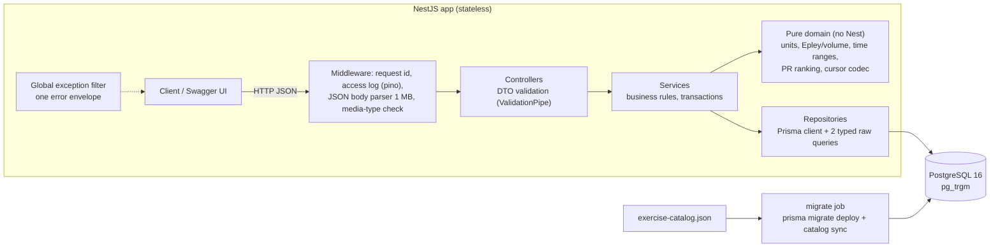
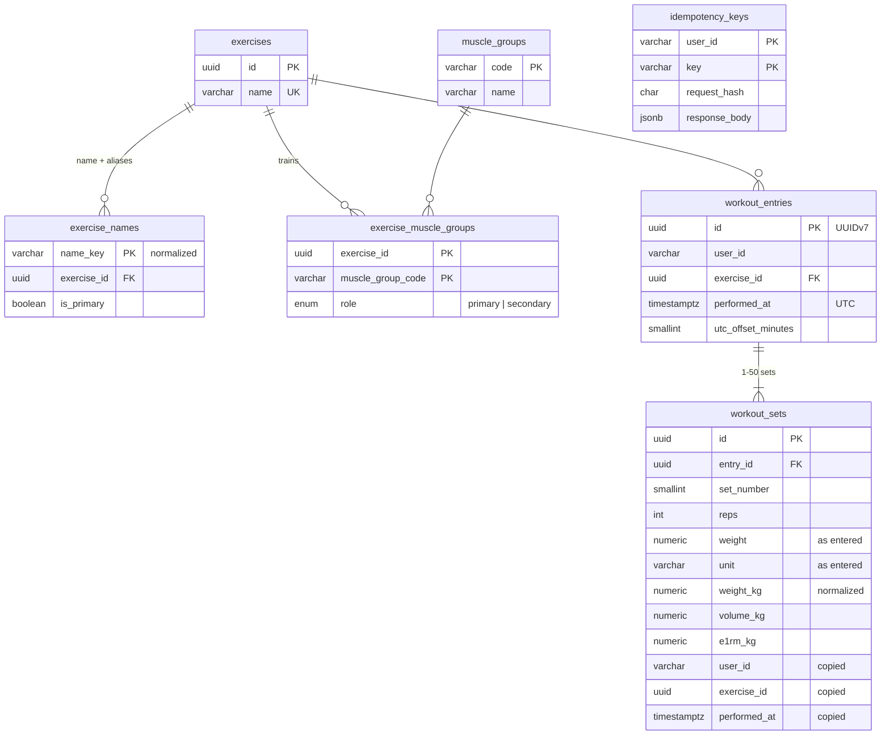

# Workout Logging API

Coaches log their clients' workouts (exercises, sets, weights) and query history and personal records (PRs).
NestJS 12 + TypeScript 6, PostgreSQL 16, Prisma 7. Built for the Everfit Backend Engineer assignment with an
AI-first workflow; see [AI_WORKFLOW.md](AI_WORKFLOW.md).

| Document | What is in it |
|---|---|
| This README | Setup, API, schema, decisions, trade-offs, scaling |
| [docs/DESIGN.md](docs/DESIGN.md) | Full design record: requirement traceability, decisions D1–D13, timezone and concurrency notes |
| [docs/PERFORMANCE.md](docs/PERFORMANCE.md) | Measurements on 50,000 entries per user, query plans, known limits |
| [docs/CATALOG.md](docs/CATALOG.md) | The 57 accepted exercises, their aliases and muscle groups |
| [docs/ESTIMATION.md](docs/ESTIMATION.md) | Time estimate, written before any code (commit `a68da97`, 2026-10-02) and its revisions |
| [AI_WORKFLOW.md](AI_WORKFLOW.md) | How AI was used, 26 logged corrections, rejected suggestions |
| Swagger UI | `http://localhost:3000/docs` (OpenAPI JSON at `/docs-json`) |

## 1. Quick start

Requirements: Docker with Compose. Nothing else is needed.

```bash
docker compose up --build
```

Compose starts three services in order:
1. `postgres` (PostgreSQL 16).
2. `migrate`, a one-shot job. It applies the Prisma migrations and syncs the exercise catalog, then exits 0.
3. `api` on port 3000. It starts only after `migrate` succeeded.

Once it is up:
- Swagger UI: http://localhost:3000/docs. It shows each request's duration.
- Health check: `curl localhost:3000/health`. It returns `{"status":"ok", …}` when the database is reachable.

```bash
curl -s -X POST localhost:3000/api/v1/users/coach-1/workouts -H 'content-type: application/json' \
  -d '{"entries":[{"exerciseName":"Bench Press","date":"2026-09-24T18:30:00+07:00","sets":[{"reps":5,"weight":100,"unit":"kg"}]}]}'
curl -s 'localhost:3000/api/v1/users/coach-1/personal-records?exercise=bench%20press'
```

Optional dataset of 50,000 entries per user, used for the performance evidence (about 2 minutes):
`docker compose --profile perf run --rm seed-perf`. Details in [docs/PERFORMANCE.md](docs/PERFORMANCE.md) §1.

If ports 3000 or 5432 are taken on your machine: `API_PORT=3100 POSTGRES_PORT=5433 docker compose up --build`.

### Local development

```bash
nvm use                  # Node 24.21.0 (.nvmrc)
npm ci
docker compose up -d postgres migrate
cp .env.example .env     # DATABASE_URL points at the compose Postgres on localhost:5432
npm run start:dev
```

| Command | Purpose |
|---|---|
| `npm run lint`, `npm run typecheck` | ESLint (type-aware) and `tsc --noEmit` |
| `npm test` | Unit tests (pure domain, validators, error mapping) |
| `npm run test:e2e` | Integration tests against a real PostgreSQL 16 started with Testcontainers |
| `npm run seed` | Sync `prisma/seed/exercise-catalog.json` into the database (idempotent) |
| `npm run seed:perf`, `npm run perf:plans`, `npm run perf:latency` | Performance dataset and measurements |

Configuration is validated at startup with zod (`src/config/env.schema.ts`). The app refuses to start with an
invalid environment.

| Variable | Default | Notes |
|---|---|---|
| `DATABASE_URL` | — (required) | `postgres://` or `postgresql://` URL |
| `PORT` | `3000` | |
| `LOG_LEVEL` | `info` | `fatal` … `trace` |
| `NODE_ENV` | `development` | `development` enables pretty logs |
| `API_PORT`, `POSTGRES_PORT` | `3000`, `5432` | Compose host ports only |

## 2. Architecture



- **Layers:** controller (HTTP and DTOs) → service (rules) → repository (SQL).
  - Controllers hold no logic.
  - Services do not expose Prisma types.
  - The calculations live in plain TypeScript and are unit-tested without Nest: unit conversion, Epley,
    volume, date ranges, PR tie-breaking.
- **Modules:**
  - `workouts`: POST and history.
  - `records`: PRs and compare.
  - `exercises`: catalog repository and catalog sync.
  - `units`: weight-unit registry.
  - `common`: errors, logging, pagination, time.
  - `config`, `database`, `health`.
- **Dependency injection:**
  - `PrismaService` is one pool per process, pinned to `TimeZone=UTC`.
  - `CLOCK` provides "now". Tests override it for "this month" comparisons and the future-date rule.
  - Services and repositories are providers.
- **Cross-cutting:**
  - A global `ValidationPipe` with `whitelist`, `forbidNonWhitelisted` and `transform`, so unknown fields give 400.
  - One exception filter produces every error body.
  - Structured JSON logs (pino) carry a request id that is echoed in the `x-request-id` header. Logs hold no
    personal data: access lines record only the request id, method and URL.
- **Docker:** a multi-stage build.
  - The runtime image holds production dependencies only, runs as a non-root user and has a healthcheck.
  - Migrations and the catalog sync run in a separate `migrate` image.

### Why NestJS, PostgreSQL and Prisma

| Choice | Why | Alternative considered |
|---|---|---|
| NestJS | Recommended by the brief. Its modules and DI match the "dependency injection" criterion. Pipes and filters give one place for validation and error formatting | Plain Fastify (no DI conventions) |
| PostgreSQL | An entry and its sets are relational. PRs are aggregations over indexed numeric columns. `NUMERIC` keeps weights exact. A bulk insert is one ACID transaction. Unique constraints make idempotency safe. `pg_trgm` serves partial names | MongoDB: indexing PRs over embedded sets needs multikey indexes and `$unwind`, and exact decimal arithmetic is awkward |
| Prisma 7.10 (pinned) | Type-safe client, reviewable SQL migrations, team familiarity. A spike verified each feature before the choice (DESIGN §13a). Two queries are typed raw SQL where the client falls short: the keyset history page (Prisma's own cursor is O(depth)) and trigram "did you mean" suggestions | Drizzle, Kysely, raw `pg` |

## 3. API

Base path `/api/v1`, JSON in camelCase, and `userId` in the path (`^[A-Za-z0-9_-]{1,64}$`). There is no
authentication, as the brief states. The full schemas are in Swagger.

| Method | Path | Purpose |
|---|---|---|
| POST | `/users/{userId}/workouts` | Log one or more exercises with their sets (bulk, all-or-nothing) |
| GET | `/users/{userId}/workouts` | History, newest first, filtered, cursor-paginated, in a chosen unit |
| GET | `/users/{userId}/personal-records` | Max weight, max volume and best Epley 1RM for one exercise, with dates |
| GET | `/users/{userId}/personal-records/compare` | The records of two periods (e.g. this month vs last month) with deltas |
| GET | `/health` | Database reachability (503 when it is down) |

### 3.1 POST `/users/{userId}/workouts`

```json
{ "timezone": "Asia/Ho_Chi_Minh",
  "entries": [
    { "exerciseName": "Bench Press", "date": "2026-09-24T18:30:00+07:00",
      "sets": [ { "reps": 5, "weight": 100, "unit": "kg" }, { "reps": 8, "weight": 185, "unit": "lb" } ] },
    { "exerciseName": "back squat", "date": "2026-09-26", "sets": [ { "reps": 5, "weight": 140, "unit": "kg" } ] } ] }
```

**Request rules:**
- **Entries and sets:** 1–100 entries; 1–50 sets per entry.
- **reps:** an integer from 1 to 1000.
- **weight:** 0–2000 in the unit given, with at most 3 decimals. 0 means a bodyweight set.
- **unit:** `kg` or `lb`. Unit codes are case-sensitive.
- **Body size:** at most 1 MB, `application/json` only.
- **date:** one of two forms:
  - An ISO-8601 datetime **with an offset** (`Z` or `+07:00`).
  - A date-only `YYYY-MM-DD` together with the top-level IANA `timezone`.

  A datetime without an offset is rejected rather than guessed. Years must be 1900–2100. A date more than
  24 hours in the future is rejected, because logs record workouts that happened (D12).
- **exerciseName:** must be in the [catalog](docs/CATALOG.md) (a name or an alias). Matching ignores case and
  extra spaces. An unknown name gets `UNKNOWN_EXERCISE` with up to 3 suggestions.
- **Idempotency-Key** (optional header, 1–128 characters `A-Za-z0-9_.:-`, scoped per user):
  - The same key with the same body replays the stored response: `200` with `Idempotent-Replayed: true`.
  - The same key with a different body gets `409 IDEMPOTENCY_KEY_REUSED`.

**Response:** `201`. Each set echoes what was logged and the normalized `weightKg`. The date-only entry starts at
local midnight in Hanoi.

```json
{ "data": { "entries": [
    { "id": "01a11ff0-…", "exercise": { "id": "01a11fc4-…", "name": "Bench Press" },
      "performedAt": "2026-09-24T11:30:00.000Z", "localDate": "2026-09-24", "utcOffsetMinutes": 420,
      "sets": [ { "setNumber": 1, "reps": 5, "weight": 100, "unit": "kg", "weightKg": 100 },
                { "setNumber": 2, "reps": 8, "weight": 185, "unit": "lb", "weightKg": 83.91 } ] },
    { "id": "01a11ff0-…", "exercise": { "id": "01a11fc4-…", "name": "Back Squat" },
      "performedAt": "2026-09-25T17:00:00.000Z", "localDate": "2026-09-26", "utcOffsetMinutes": 420,
      "sets": [ { "setNumber": 1, "reps": 5, "weight": 140, "unit": "kg", "weightKg": 140 } ] } ] },
  "meta": { "created": 2 } }
```

### 3.2 GET `/users/{userId}/workouts`

All parameters are optional and combine with AND. An unknown parameter is a 400.

| Param | Meaning |
|---|---|
| `exercise` | Part of a name or alias (`bench` matches Bench Press, Incline Bench Press, …), case-insensitive, matched literally |
| `muscleGroup` | A catalog code (`chest`, `quads`, … see [CATALOG.md](docs/CATALOG.md)), primary or secondary; an unknown code is `400 UNKNOWN_MUSCLE_GROUP` with the valid list |
| `from`, `to` | Inclusive bounds. A date-only value covers the whole local day in `tz`; a datetime needs an offset |
| `tz` | IANA zone for date-only bounds; default `UTC` |
| `unit` | Return every weight in `kg` or `lb`; omit it to keep each set as logged |
| `limit` | 1–100, default 20 |
| `cursor` | `meta.nextCursor` of the previous page |

`GET …/workouts?exercise=bench&unit=lb&limit=1&tz=Asia/Ho_Chi_Minh` returns:

```json
{ "data": [ { "id": "01a11ff0-…", "performedAt": "2026-09-24T11:30:00.000Z", "localDate": "2026-09-24", "utcOffsetMinutes": 420,
    "exercise": { "id": "01a11fc4-…", "name": "Bench Press",
      "muscleGroups": [ { "code": "chest", "role": "primary" }, { "code": "front_delts", "role": "secondary" }, { "code": "triceps", "role": "secondary" } ] },
    "sets": [ { "setNumber": 1, "reps": 5, "weight": 220.46, "unit": "lb" }, { "setNumber": 2, "reps": 8, "weight": 185, "unit": "lb" } ] } ],
  "meta": { "limit": 1, "unit": "lb", "timezone": "Asia/Ho_Chi_Minh", "hasMore": true, "nextCursor": "eyJwIjoi…" } }
```

- **Order:** `performedAt` descending, then `id`.
- **Cursor:** opaque, keyset-based (`performedAt`, `id`). Pages never duplicate or skip entries, even when many
  share one instant. Their cost does not depend on page depth.
- **Units:** a weight already in the requested unit is returned as logged. A converted weight is computed from the
  logged value and rounded once, to 2 decimals.
- **No results:** a filter with no match is not an error: `200`,
  `{"data":[],"meta":{…,"hasMore":false,"nextCursor":null,"message":"No workouts found for the given filters."}}`.

### 3.3 GET `/users/{userId}/personal-records`

Parameters: `exercise` (required: a name or alias, exact), optional `from`/`to`/`tz` (as above), and `unit`
(default `kg`). The response for the two Bench Press sets above:

```json
{ "data": { "exercise": { "id": "01a11fc4-…", "name": "Bench Press" }, "unit": "kg",
    "range": { "from": null, "to": null, "timezone": "UTC" },
    "maxWeight":        { "value": 100,    "set": { "reps": 5, "weight": 100 },   "achievedAt": "2026-09-24T11:30:00.000Z", "localDate": "2026-09-24", "entryId": "01a11ff0-…", "setNumber": 1 },
    "maxVolume":        { "value": 671.32, "set": { "reps": 8, "weight": 83.91 }, "achievedAt": "2026-09-24T11:30:00.000Z", "localDate": "2026-09-24", "entryId": "01a11ff0-…", "setNumber": 2 },
    "bestEstimated1RM": { "value": 116.67, "set": { "reps": 5, "weight": 100 },   "achievedAt": "2026-09-24T11:30:00.000Z", "localDate": "2026-09-24", "entryId": "01a11ff0-…", "setNumber": 1 } },
  "meta": {} }
```

- Each record can come from a different set. Here the 185 lb × 8 set wins on volume: 8 × 83.91 = 671.32 kg.
- **Ties:** higher value, then more reps, then the earliest date, then the set logged first (D4).
- **No weighted sets** in the range: the three records are `null`, and `meta.message` explains why. It says
  either that there are no weighted sets, or that only bodyweight sets were logged.

### 3.4 GET `/users/{userId}/personal-records/compare`

Pass `exercise`, `unit` and `tz`, plus **either**:
- `period=week|month|year`: the current period up to now against the whole previous period, with local midnights
  in `tz` and weeks starting on Monday.
- **or** all four of `currentFrom`, `currentTo`, `previousFrom`, `previousTo`.

Each period's record is the best set inside that period. `delta.<metric>` is `{ absolute, percent, improved }`, or
`null` when either side has no record. For September vs August 2026 in Hanoi, after an extra 95 kg × 3 set logged
on 20 August:

```json
{ "data": { "current":  { "from": "2026-08-31T17:00:00.000Z", "to": "2026-09-30T16:59:59.999Z", "maxWeight": { "value": 100, … }, … },
            "previous": { "from": "2026-07-31T17:00:00.000Z", "to": "2026-08-31T16:59:59.999Z", "maxWeight": { "value": 95, … }, … },
            "delta": { "maxWeight": { "absolute": 5, "percent": 5.26, "improved": true },
                       "maxVolume": { "absolute": 386.32, "percent": 135.55, "improved": true },
                       "bestEstimated1RM": { "absolute": 12.17, "percent": 11.64, "improved": true } } } }
```

### 3.5 Errors

Every error has the same shape, produced by one global filter:

```json
{ "error": { "code": "VALIDATION_ERROR", "message": "Request validation failed",
             "details": [ { "path": "entries[0].sets[0].reps", "code": "MIN", "message": "reps must not be less than 1" },
                          { "path": "entries[0].sets[0].unit", "code": "UNSUPPORTED_UNIT", "message": "Unit 'stone' is not supported. Supported: kg, lb" } ] },
  "requestId": "57339d9d-091b-4b78-9439-ee01e72620e3" }
```

| HTTP | `error.code` | When |
|---|---|---|
| 400 | `VALIDATION_ERROR` | Any invalid path, header, body or query value. One detail per problem, with a JSON path |
| 400 | `MALFORMED_JSON` | The body is not valid JSON |
| 400 | `INVALID_DATE_RANGE` | `from` is after `to` |
| 400 | `INVALID_CURSOR` | A cursor this API did not issue |
| 400 | `UNKNOWN_MUSCLE_GROUP` | `muscleGroup` is not in the catalog (the message lists the valid codes) |
| 400 | `BAD_REQUEST` | Other client errors raised by the HTTP layer (e.g. an aborted request) |
| 404 | `ROUTE_NOT_FOUND` | Unknown route |
| 409 | `IDEMPOTENCY_KEY_REUSED` | The same `Idempotency-Key` with a different body |
| 413 | `PAYLOAD_TOO_LARGE` | Body over 1 MB |
| 415 | `UNSUPPORTED_MEDIA_TYPE` | Body not `application/json`, or an unsupported encoding or charset |
| 503 | `SERVICE_UNAVAILABLE` | `/health` when the database is down |
| 500 | `INTERNAL_ERROR` | Unexpected. The message is generic; the details go to the logs with the request id |

Detail codes in `error.details[].code`:
- Codes the API sets itself (`DetailCode` in `src/common/errors/error-codes.ts`): `UNSUPPORTED_UNIT`,
  `UNKNOWN_EXERCISE` (with `suggestions`), `DATE_IN_FUTURE`, `INVALID_DATE`, `MISSING_OFFSET`, `MISSING_TIMEZONE`,
  `INVALID_TIMEZONE`, `BLANK`, `UNKNOWN_FIELD`, `REQUIRED` and `CONFLICT` (compare: `period` vs explicit bounds),
  `MATCHES`, and `DOWN` (health).
- Every other detail code is the failed validation rule in UPPER_SNAKE_CASE: `IS_DEFINED`, `IS_INT`, `MIN`, `MAX`,
  `MAX_DECIMAL_PLACES`, `ARRAY_MIN_SIZE`, `NESTED_VALIDATION`, and so on.

**Validation runs in two stages.** First the request's shape is checked (types, ranges, required fields). Then its
meaning is checked: dates, time zones, catalog names, idempotency. If the first stage fails, its problems are
reported and the second stage does not run. The example above therefore does not report the misspelled name or the
missing offset yet.

## 4. Data model



| Index | Serves |
|---|---|
| `workout_entries (user_id, performed_at DESC, id DESC)` | History pages: a keyset scan that stops after `limit + 1` rows |
| `workout_entries (user_id, exercise_id, performed_at DESC, id DESC)` | History filtered by name or muscle group: one `LATERAL` scan per matched exercise (M5-A) |
| `workout_sets (user_id, exercise_id, performed_at, weight_kg, reps, volume_kg, e1rm_kg, id)` | PRs and compare. A covering index, so Index Only Scans with 0 heap fetches (D10); date-ordered, so ranges stay cheap |
| `workout_sets (entry_id, set_number)` unique | The sets of one history page in a single query; set order |
| `exercise_names (name_key)` PK + GIN `gin_trgm_ops` | Exact name lookup; partial match and "did you mean" suggestions |
| `exercise_muscle_groups (muscle_group_code, exercise_id)` | Muscle-group filter |
| `idempotency_keys (user_id, key)` PK | Idempotent replays and the race between concurrent retries |

Every query path and its plan on 50k entries is documented in [docs/PERFORMANCE.md](docs/PERFORMANCE.md).

### Design decisions

- **Original value plus normalized kg.**
  - `weight` and `unit` are stored exactly as entered.
  - `weight_kg` (`NUMERIC(10,4)`, never a float) is the one comparable value.
  - `volume_kg` and `e1rm_kg` are computed once, at write time, by the same tested TypeScript functions that the
    API uses. The formula exists in only one place; the cost is that changing it needs a backfill.
- **Rounding once.**
  - The stored 4-decimal kg columns are used to filter, sort and pick candidates.
  - Response values are recomputed from the original `reps`, `weight` and `unit` and rounded once, to 2 decimals.
  - Rounding the stored value again would round twice: 32 lb would come out as 14.52 kg instead of 14.51 (C16).
- **The unit registry is the single source of truth** (`src/units/weight-units.ts`).
  - It drives validation, the OpenAPI enum and conversions.
  - Adding stone is one line, `{ code: 'st', label: 'stone', toKgFactor: '6.35029318' }`. A unit test proves that a
    registry with stone converts correctly, and an e2e test proves that the OpenAPI enum follows the registry.
  - The DB column is plain `varchar`, so no migration is needed.
  - The 2000 weight limit applies in the unit sent, so 2000 st (12.7 t) would pass. It still fits the columns.
- **Copied columns on sets.** `user_id`, `exercise_id` and `performed_at` are copied from the entry, so a PR query
  reads one covering index without a join. Entries are immutable here, so the copies cannot drift.
- **A closed, configurable exercise catalog** (D5).
  - The catalog is `prisma/seed/exercise-catalog.json`: names, aliases, and primary and secondary muscles.
  - The `migrate` job syncs it idempotently.
  - The muscle-group mapping is data, not code. Adding an exercise or remapping one means editing the JSON and
    re-running the sync.
  - Unknown names are rejected with suggestions instead of being created, which avoids typos becoming exercises.
- **No users table.** Authentication is out of scope, so `userId` is a validated path parameter.

## 5. Calculations and rules

| Rule | Implementation |
|---|---|
| Volume | `reps × weight_kg` |
| Epley 1RM | `weight_kg × (1 + reps / 30)`, applied **literally for every rep count, including 1** (D3). The brief gives this formula; the common r > 1 convention would rank differently: 100 × 1 → 103.33 beats 96 × 2 → 102.40 |
| PR ranking | Highest value → more reps → earliest date → set logged first. Candidates come from the 4-decimal column; the winner is decided on exact values (C21) |
| Bodyweight sets (weight 0) | Valid logs, never PRs. Only bodyweight in a range → null records + message |
| Future dates | Rejected beyond 24 h after the server's now (D12): a typo year would otherwise become a permanent PR |

## 6. Edge cases from the brief

| Brief | Behaviour | Tested in |
|---|---|---|
| Invalid or unsupported unit | 400, detail `UNSUPPORTED_UNIT` at the exact item (`entries[1].sets[2].unit`), listing the supported units | `workouts-create`, `workouts-history`, `personal-records` e2e |
| Missing or malformed fields (null date, negative weight/reps, empty sets) | 400 with one detail per problem and its JSON path; nothing stored | Table-driven matrix in `workouts-create.e2e-spec.ts` (39 cases) |
| Date range with no data | 200, empty `data` or `null` records, and `meta.message` | history, records, compare e2e |
| Timezone handling | §7 | `time.spec.ts` (DST days, month ends, leap year), history/records/compare e2e |
| Concurrent writes, same user + exercise | All committed; idempotent retries write once | `workouts-concurrency.e2e-spec.ts` |
| 50,000+ entries per user | p95 < 50 ms on every endpoint (§9) | `docs/PERFORMANCE.md`, scripts under `src/cli/perf-*` |

## 7. Timezone strategy

- **Stored values.** Instants are stored as `timestamptz` (UTC), together with the `utc_offset_minutes` the client
  logged with. `localDate` in responses is the calendar date at that offset, i.e. the day the workout happened for
  the client.
- **Input that needs a zone.** A datetime must carry an offset; without one it is rejected, never read in the
  server's zone. A date-only value needs an IANA `timezone`.
- **Range filters and "this month"** use the request's `tz` (default `UTC`). Boundaries are local midnights
  computed with Luxon, so a DST day lasts 23 or 25 hours; they are then compared in UTC.
- **Database sessions** are pinned to UTC (C17), so a server with another default zone cannot shift stored
  instants.

**Trade-offs:**
- **Buckets follow the query's `tz`.** A workout at 23:30 in Hanoi belongs to the next day in UTC. Correct buckets
  need the client to send its zone. A user who travels sees buckets in whatever zone they query with.
- **Alternative rejected:** storing a `local_date` column for stable buckets. Ranges across zones would then be
  ambiguous; the stored offset keeps the local date recoverable anyway.

## 8. Concurrency and idempotency

- **Append-only writes.** Two devices logging the same exercise at the same moment both succeed. Nothing does
  read-modify-write, because PRs are computed on read, so no update can be lost.
- **All-or-nothing.** A bulk request runs in one transaction: entries, sets and the idempotency record.
- **Retries.** With an `Idempotency-Key`, the key row is inserted last, in the same transaction:
  - A concurrent duplicate blocks on the primary key, rolls back its own rows, then replays the stored response.
  - If the duplicate's body differs, it gets 409.
  - Tested with 20 parallel requests.

## 9. Performance (50,000+ entries per user)

The full evidence is in [docs/PERFORMANCE.md](docs/PERFORMANCE.md). It covers:
- a deterministic seed;
- query plans captured with `auto_explain` from the real code;
- latency measured against the running API;
- targets written before measuring.

| Endpoint (user with 50k entries, warm, sequential) | p95 |
|---|---:|
| History, any filter, any page depth | ≤ 6.1 ms |
| PRs, the most-logged exercise (53k weighted sets) | 31.0 ms |
| PRs, background users with 2k entries / exercises ranked 4–15 by frequency | 7.7 ms / 20.5 ms |
| Compare | 7.8 ms |
| POST one entry / 100 entries × 50 sets | 4.4 ms / 328 ms |

Known limits, all measured:
- **Worst-case user.** PRs scan every set of one (user, exercise), so a user with 50k entries of a **single**
  exercise takes 89.9 ms p95.
- **Concurrent PR load.** 20 simultaneous PR requests for the largest exercise take p95 491 ms on 2 vCPUs (command
  output, `28531d7`).
- **Cold cache.** Cold-cache reads of the largest PR slice are slower: 61–188 ms per statement in single samples.

§10 covers what changes at scale.

## 10. Trade-offs and what changes at scale

**Trade-offs taken:**
- **PRs are computed on read** (D6), not maintained on write.
  - Pro: no write-path logic and no drift.
  - Con: the cost grows with one exercise's set count (above).
- **Covering index ordered by date** (D10), not by metric.
  - Pro: ranges and compare stay at a few ms (≤ 3.9 ms per statement, even for the worst-case user), and there
    are no extra index writes.
  - Con: an all-time PR reads the whole slice.
- **A closed catalog** (D5): consistent data, but new exercises need a JSON edit and a sync.
- **Tie overflow left unbounded.** When more than 50 sets tie exactly on the top value, the follow-up query fetches
  all of them. That costs 7.6 ms at 174 ties; it would need tens of thousands of identical sets to matter.
- **Contract choices:**
  - POST returns `data.entries`; history returns `data` as a list.
  - The body uses `exerciseName` and `timezone`; queries use `exercise` and `tz`.
  - `UNKNOWN_MUSCLE_GROUP` is a top-level code, whereas an unknown exercise is a validation detail with a path.
  - Compare adds `meta.message` only when **both** periods are empty. A single empty side shows as `null` records
    and `null` deltas.

**10,000 concurrent coaches.** Today's numbers, on 2 vCPUs, give rough estimates. Each is computed as
concurrency ÷ p50 of a measured batch of 20, so treat them as estimates, not benchmarks:
- History: about 20 / 29.6 ms ≈ 675 requests/s.
- PRs on the largest exercise: about 20 / 476 ms ≈ 42 requests/s.

What would change, in order of impact:
1. **Authentication and tenancy.** Coaches may only access their own clients. This is required before anything
   else, and adds `coach_id` to the queries and indexes.
2. **A PR summary table**, one row per user, exercise and metric, updated in the POST transaction. All-time PRs
   become O(1) and remove the CPU-bound case above. Ranges keep using the covering index.
3. **Connections.**
   - The API is stateless, so scale it horizontally behind a load balancer.
   - PgBouncer in transaction mode.
   - A configured pool size and `statement_timeout`; today it is pg's default of 10 connections, with no timeout.
4. **Read replicas** for history, PRs and compare. Writes are small and append-only.
5. **Data growth.** Partition `workout_sets` and `workout_entries` by `user_id` hash, or by time, once they reach
   hundreds of millions of rows. Add a TTL cleanup job for idempotency keys; the `created_at` index is already in
   place.
6. **Edge and operations.**
   - Rate limiting per coach.
   - Caching the catalog lookups.
   - Per-route p95 dashboards and a slow-query log.
   - Swagger served in production only behind auth.

**Follow-ups found in the final review (not done; outside the fixed scope):**
- The catalog sync never removes muscle groups deleted from the JSON.
- `METHOD_NOT_ALLOWED` is reserved but never emitted; Express answers 404.
- `idempotency_keys.response_status` is stored but replays always return 200.
- A few `as` casts remain where narrowing helpers would be cleaner.

## 11. Testing

```bash
npm test            # unit: 222 tests: domain math, units, time/DST, PR ranking, validators, error mapping, perf tooling
npm run test:e2e    # integration: 152 tests against PostgreSQL 16 in Testcontainers (real migrations, real catalog)
```

- **Unit tests** cover every calculation. They were written test-first, with expected values taken from the brief
  (Epley, volume), real conversion factors (lb = 0.45359237 kg exactly) and real calendars (DST in New York and
  Santiago, leap years).
- **Integration tests** run the real Nest app with Supertest against a real PostgreSQL. Never SQLite or mocks:
  indexes, `NUMERIC`, time zones and concurrency behave differently there. They cover:
  - each endpoint's happy path;
  - the validation matrix;
  - empty ranges;
  - pagination continuity with many entries at one instant;
  - tie-breaking;
  - idempotency races;
  - the catalog sync;
  - a database whose default zone is not UTC.
- **Performance** is measured by scripts, not tests, because timings depend on the machine. See §9.

## 12. Project layout

```
src/
  common/       errors (envelope, codes, filter), logging, pagination (cursor), time (zones, ranges), validation
  config/       zod env schema, fail-fast config module
  database/     PrismaService, pg adapter (UTC sessions)
  units/        weight-unit registry and validator
  exercises/    catalog repository, catalog JSON validation and sync
  workouts/     POST + history: controller, services, repositories, DTOs, pure set metrics
  records/      PRs + compare: controller, service, repository, DTOs, pure ranking and deltas
  health/       /health (terminus)
  perf/, cli/   performance dataset, seed and measurement CLIs; catalog sync CLI
prisma/         schema, migrations, seed data (exercise-catalog.json, perf-profile.json)
test/           e2e specs + Testcontainers setup
docs/           DESIGN, PERFORMANCE (+ perf/ raw plans), CATALOG, ESTIMATION, adr/
```

## 13. Out of scope

Authentication and authorization, a CI pipeline (tests run locally with the npm scripts), editing or deleting
entries, user profiles or stored preferences (unit and zone are sent per request), a catalog endpoint (D9: the
catalog is published in [docs/CATALOG.md](docs/CATALOG.md) and errors return suggestions), rate limiting, caching,
multi-region.
